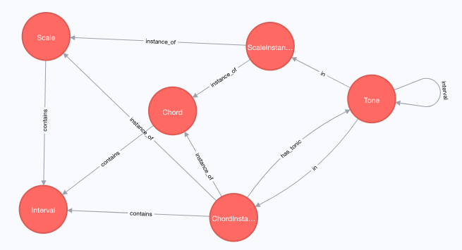

# music-graph

Creates a graph representing a number of music theory concepts in a neo4j instance.

# Regenerate the Database

## Configuration

```
yarn install

export NEO4J_URL=bolt://localhost
export NEO4J_USER=neo4j
export NEO4J_PASSWORD=admin
```

## Run

node generate-music-graph.js

More coming soon.

# Database Schema



# Example Queries:

The following examples show the structure, and things you can do with this.

## Find the circle of 5ths!

```
MATCH (c:Tone { name: 'C' })-[:interval* { distance: '5P' }]->(o:Tone)
RETURN o.name;
```

This just identifies a path through all notes, where each node in the path is
the distance of a perfect 5th away from the previous.

## Interval Separation Between Notes

```
MATCH (ci:ChordInstance)-[:contains { instance: 'D' }]->(i:Interval { name: '3M' })
RETURN ci.name, i.name;
```

This query displays all chords that use the note D as a major third.  Of course, these
are all Bb chords, since D is a third from Bb.

## Identify all Pentatonic Scales

```
MATCH (s:Scale)-[:contains]->(i:Interval) 
WITH s, count(i) as intervals 
WHERE intervals = 5 RETURN s.name;
```

A pentatonic scale is any that has 5 tones.  Of course this returns things like
the minor pentatonic scale, but also others, such as egyptian, and pelog.
